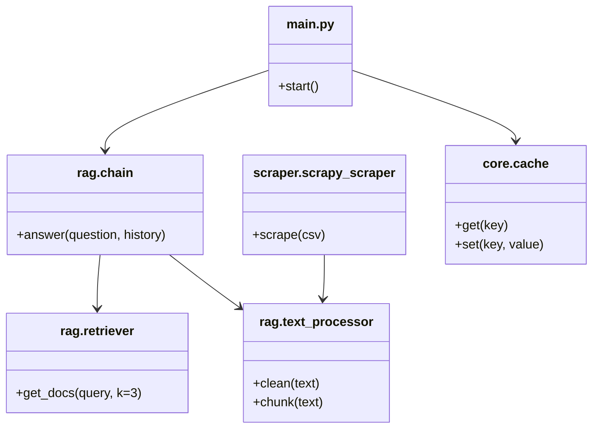
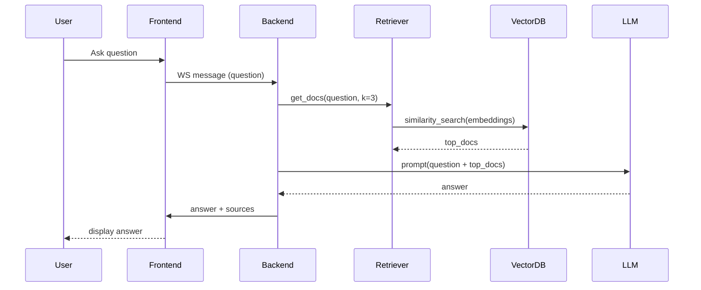

# College Buddy — Architecture & Design

This document describes the high-level architecture, UML diagrams, and the design methodology used for the College Buddy project. It is intended for maintainers, contributors, and for onboarding new engineers.

## Overview

College Buddy is a modular, Python-based assistant that uses a Retrieval-Augmented Generation (RAG) approach to answer questions from college websites and local data. It is structured as a modular monolith with well-separated packages for scraping, ingestion, retrieval, model chain, and the web API.

Key runtime components:
- Frontend: static HTML/JS (Tailwind) served by the backend or a static host.
- Backend API: FastAPI app (websocket + REST) exposing chat and admin endpoints.
- Scraper: Scrapy-based scraper that produces `data/scraped/scraped_data.json`.
- Ingestion / RAG pipeline: text processor, chunker, embedding generator, and vector store (Chroma).
- Vector DB: Chroma files in `chroma/`.
- Cache: response cache for recent Q&A (TTL-based) maintained under `data/cache/`.

## Component Diagram (Mermaid)

```mermaid
graph TD
  A[Frontend (Browser)] -->|WS / HTTP| B[FastAPI Backend]
  B --> C{RAG Chain}
  C --> D[Retriever]
  D --> E[Chroma Vector DB]
  C --> F[LLM / Embedding APIs]
  B --> G[Analytics / Logging]
  B --> H[Cache (response_cache.json)]
  I[Scraper (Scrapy)] --> J[data/scraped/scraped_data.json]
  J --> K[Ingest / Embeddings]
  K --> E
  style F fill:#f9f,stroke:#333,stroke-width:1px
```

## Class / Module View (Mermaid)

Shows main Python modules and responsibilities.



## Sequence Diagram (typical user query)



## Deployment Diagram (Mermaid)

```mermaid
graph LR
  subgraph LocalDev
    devPC[Developer Machine]
  end
  subgraph Cloud
    render[Render / Host]
    storage[Persistent storage (Chroma files, scraped JSON)]
  end
  devPC -->|git push| render
  render --> storage
  storage --> render
```

## Data Flow

1. The scraper reads `data/links/structured_links.csv` and crawls each URL to produce `data/scraped/scraped_data.json`.
2. The ingestion pipeline processes the scraped pages: cleaning, splitting into chunks, creating embeddings (via embeddings API), and storing them in Chroma.
3. At query time the retriever performs a k-NN similarity search (k=3 by default), returning top documents.
4. The chain constructs a prompt with the question and retrieved sources, then queries the LLM for the final answer.
5. Responses are cached for quick repeat access and logged for analytics.

## Design Methodology

- Architectural style: Modular Monolith. The repository is organized into self-contained packages (`scraper/`, `rag/`, `core/`, `data/`, `scripts/`) so the codebase is easy to run locally and easy to split into services later if needed.
- Development methodology: Incremental, test-driven where practical. Implement small features, add lightweight tests in `tests/`, and validate ingestion + retrieval results.
- Principles applied:
  - Single Responsibility & Separation of Concerns: distinct modules for scraping, processing, retrieval, and API.
  - Idempotent ingestion: scraper output is stored as JSON and ingestion is repeatable.
  - Observability: logging for scraping, ingestion, API requests, and analytics.
  - Performance-first: practical optimizations like smaller k, disabling extra LLM calls, and response caching.
  - Security: API keys stored outside source (e.g., `tkr-chatbot-key.json` and env vars). Validate and sanitize scraped content before sending it to models.

## Contracts and Interfaces (tiny contract)
- get_docs(query: str, history: Optional[list], k: int=3) -> List[Document]
  - Input: plain text query, optional chat history
  - Output: list of documents with metadata (url, page_name, chunk_text)
  - Error modes: returns empty list on failure; logs error

- scrape(csv_path: str) -> writes data/scraped/scraped_data.json
  - Input: path to CSV of URLs
  - Output: JSON file with {url, page_name, content}
  - Error modes: skips robots/forbidden pages; logs counts

## Edge Cases & Notes
- Empty or ambiguous queries: the system will fall back to context-aware concatenation; if still vague it returns a fallback answer.
- Missing web content: if a site blocks scraping or changes structure, record the page as failed and surface to the operator.
- Large documents: chunking must ensure the LLM prompt stays within token limits. Keep chunk size conservative (e.g., 500–1000 tokens) and include overlapping context when needed.

## Testing Guidance
- Add unit tests for:
  - `rag/text_processor` cleaning and chunking (happy path + long page)
  - `rag/retriever` similarity behavior (mock vector store)
  - `scraper/scrapy_scraper.py` (run in offline mode against known HTML fixtures)
- Integration test: run full scrape (small subset), ingest, ask a query, and assert source appears in response.

## Scaling & Operational Notes
- To scale beyond a single host:
  - Move Chroma to a managed vector DB or host it on shared disk backed storage
  - Split scraper and ingestion as separate worker jobs (e.g., queue + workers)
  - Add Redis or Memcached for caching responses
  - Use streaming responses from the LLM (if supported) for perceived latency improvements
- Monitoring:
  - Scrape job: success/failure counts, item counts, average content size
  - API: request latency, error rate, cache hit ratio

## Security Considerations
- Keep secrets out of repo. Use environment variables or platform secret stores.
- Sanitize HTML and remove JS before storing content.
- Respect robots.txt and site rate limits; backlog failed pages for manual review.

## Next Steps / Suggested Improvements
1. Enable streaming responses to improve perceived latency.
2. Add a light integration test that runs a subset of the pipeline (scrape → ingest → query).
3. Consider an indices metadata table for fast filtering (e.g., department → documents) to reduce retrieval scope.
4. Add documentation pages for contributor setup, deployment, and runbooks.

---
If you want, I can:
- generate PNG/SVG versions of the mermaid diagrams; or
- add a small integration test (scrape a single URL fixture, ingest, ask a query) and run it.

Updated on: 2025-11-01
